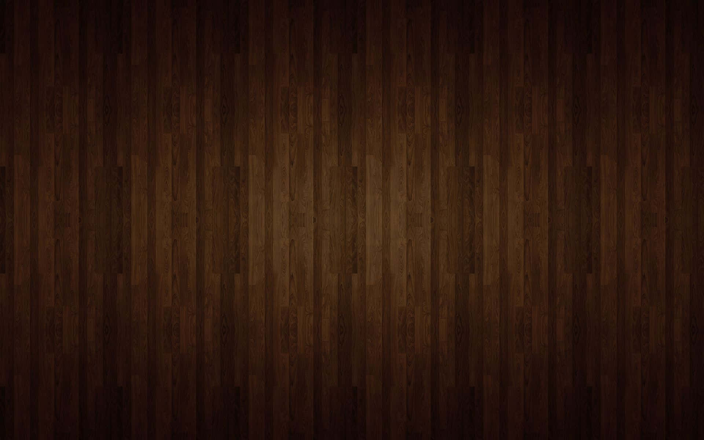
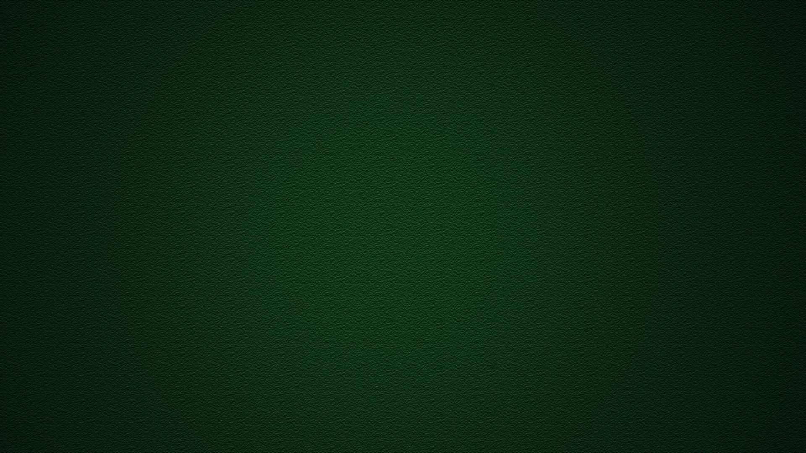
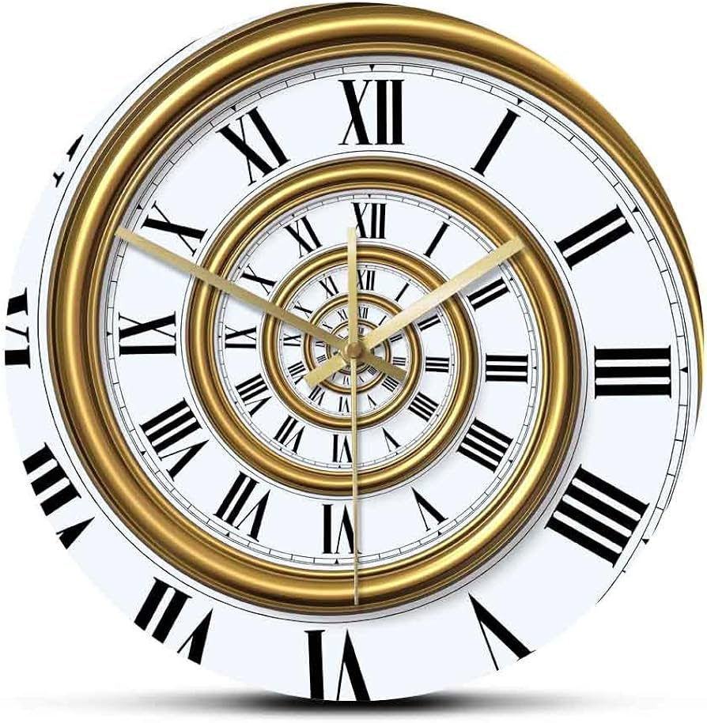

# 🌀 Impossible Staircase – Maya Modeling & Animation Project

A stylised **“impossible staircase” crystal snow globe** scene inspired by M. C. Escher’s *Ascending and Descending*, the Penrose Steps illusion (*Inception*), and London’s Big Ben, wrapped in a festive mood (tree, snow, ornaments).  
This project demonstrates **clean topology, procedural / iterative modeling, Arnold shading, MASH instanced snow dynamics, turntable presentation, and composition for portfolio rendering**.

---

## ✨ Preview

| Beauty / Glass | Tree / Base Texture | Clock Face |
|----------------|---------------------|------------|
|  |  |  |

### 🎥 Turntable

<video src="exports/turntable.mp4" width="480" loop muted playsinline controls></video>

*If inline video does not play, see the animated GIF below or download the MP4.*


---

## 🎯 Project Goals

- Convey a paradoxical “endless” staircase illusion inside a snow globe.
- Showcase production‑friendly topology & readable UV-ready geometry.
- Use **MASH + Bullet + Turbulence** for lightweight procedural snow motion.
- Present clear look‑dev through beauty, material, and structural views.
- Practice composition (rule‑of‑thirds focal energy) & soft studio lighting.

---

## 🗂 Folder Structure

.
├── scenes/
│ └── impossible_staircase_final.mb
├── exports/
│ ├── turntable.mp4
│ └── (turntable_raw.mov - optional / may be excluded)
├── assets/
│ ├── glass_foundation.jpg
│ ├── tree_texture.jpg
│ ├── tree_texture2.jpg
│ ├── clock_front.jpg
│ ├── background_cat.jpg # (reference / placeholder)
│ ├── ball_texture.png
│ └── turntable.gif
├── docs/
│ └── design_process.pdf
├── .gitignore
└── README.md


> Rename any generic filenames to descriptive ones (e.g. `beauty_render_front.jpg`, `wireframe_overlay.jpg`, `uv_layout.jpg`) for maximum clarity.

---

## 🔧 Technical Breakdown

| Aspect | Details (fill in where marked) |
|--------|--------------------------------|
| Software | Autodesk Maya (Version: **20XX / 2024** ) |
| Renderer | Arnold |
| Scene File | `scenes/impossible_staircase_final.mb` |
| Poly Count (total scene) | *(fill in)* |
| Poly Count (stair module) | *(fill in)* |
| Snowflake Instances | *(fill in)* |
| Turntable Frames | 240 @ 24 fps (10 s) |
| Output Resolution | 1920 × 1080 (MP4 optimized: 960 × 540 preview) |
| FX | MASH instancing + Bullet dynamics + Turbulence field |
| Shaders | aiStandardSurface (glass, metals, painted surfaces), lambert (base), texture maps |
| Lighting | aiSkyDomeLight (environment), aiAreaLight(s) for key & fill |
| Composition | Rule‑of‑thirds focal placement / depth layering |
| Deliverables | Beauty, texture previews, turntable video, process PDF |

---

## 🧱 Modeling Workflow

1. **Blockout** – Primitive cubes iterated into Penrose‑like stair loop.  
2. **Refinement** – Added support edges, chamfers for subdivision‑friendly curvature.  
3. **Clock Element** – Planar UV + texture placement for Big Ben face motif.  
4. **Assembly** – Integrated tree, base, spheres (bounce actors) inside glass volume.  
5. **Topology Polish** – Ensured quad dominance, removed hidden / redundant geo.  

---

## ❄ Snow System (MASH)

| Step | Action |
|------|--------|
| 1 | Create single snowflake mesh asset. |
| 2 | Build **MASH Network** to scatter inside globe bounds. |
| 3 | Enable **MASH Dynamics (Bullet)** for basic collision / gravity interplay. |
| 4 | Add **Turbulence Field** → subtle drifting randomness. |
| 5 | Tune drag, amplitude, distribution → floating, non-chaotic motion. |

---

## 🧪 Glass Shader (Arnold Example Snippet)

```python
# aiStandardSurface glass-like parameters
cmds.setAttr(f"{shader}.base", 0)
cmds.setAttr(f"{shader}.specular.weight", 1)
cmds.setAttr(f"{shader}.specular.roughness", 0)
cmds.setAttr(f"{shader}.specular.IOR", 1.5)
cmds.setAttr(f"{shader}.transmission.weight", 1)
cmds.setAttr(f"{shader}.transmission.IOR", 1.5)
cmds.setAttr(f"{shader}.transmission.color", 1, 1, 1, type="double3")

```
🎨 Composition Notes
Focal Flow: Stair apex + sphere bounce path near rule‑of‑thirds intersections.

Layering: Foreground (glass reflections) → mid (stair geometry) → micro (snow drift) → accent (clock face).

Contrast: Specular glass vs matte architecture for silhouette clarity.

Color Accents: Festive greens/reds punctuate neutral structure.

🧠 Reflection / Future Improvements
Area	Next Step
Materials	Add micro‑roughness / variation maps for realism
Animation	Refine squash & stretch timing; add secondary motion
FX	Subtle interior volumetric / god ray
Proceduralism	Script param staircase generator (step count)
Texturing	Substance pass for edge wear & breakup
Presentation	Add wireframe overlay & UV layout sheet

🚀 How to Use / View
Open scenes/impossible_staircase_final.mb in Maya.

Play timeline (ensure MASH plugins loaded) to preview bounce + snow.

Render turntable with Arnold (swap HDRI if desired).

View exports/turntable.mp4 or assets/turntable.gif for quick preview.

Read docs/design_process.pdf for process notes.

🗃 Large / Optional Assets
If large raw assets were removed (e.g. original .mov, caches), host them via GitHub Release or cloud:

Asset	Location / Link	Notes
High‑res turntable (ProRes)	(Release tag or link)	Not in repo
Raw simulation cache	(link)	Optional

📚 References & Inspiration
Cheng, J.-H. et al. (2021) Impossible Staircase: Vertically Real Walking in an Infinite Virtual Tower. IEEE VR.

Wikipedia Contributors (2021) Ascending and Descending. https://en.wikipedia.org/wiki/Ascending_and_Descending

Penrose Steps / Escher illusion concepts – educational reinterpretation.

Big Ben photographic references (public / study use).

Reference images are used strictly for educational look‑dev purposes and not for commercial redistribution.

👤 Author
Flora Xohrat
MSc Computer Animation & VFX – Bournemouth University
GitHub: Flora9822

Academic modeling & presentation exercise exploring illusion architecture, procedural instancing, and cinematic look‑dev.


---